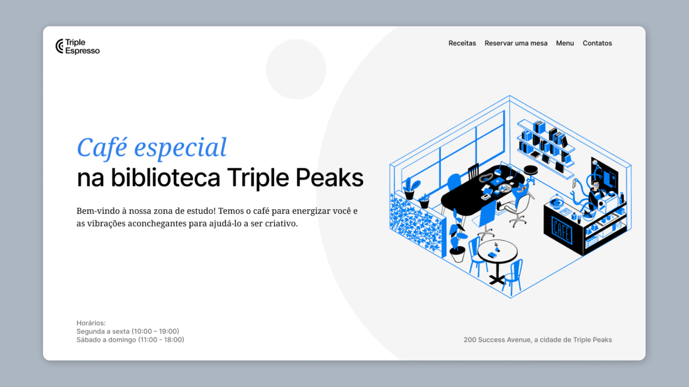

# Triple Espresso

Bootcamp Desenvolvimento Web - TripleTen

- <a href="https://herisonp.github.io/web_project_coffeeshop/" target="_blank">Veja o deploy</a>

## 👁 Preview

  

## 🚀 Tecnologias

Esse projeto foi desenvolvido com as seguintes tecnologias:

- HTML
- CSS
- Git e GitHub
- Metodoliga BEM

## 💻 Projeto

Terceiro projeto criado no Sprint 3 do bootcamp de desenvolvimento web da TripleTen.

## 🧪 Melhorias

Algumas melhorias que podem ser aplicadas:

- Background no menu fixo ao rolar a página
- Alteração da cor dos links do menu ao rolar a página
- Links âncora do menu rolar até a sessão de forma suave ao clicar
- Animação em alguns elementos da página para deixar mais dinâmico e interativo
